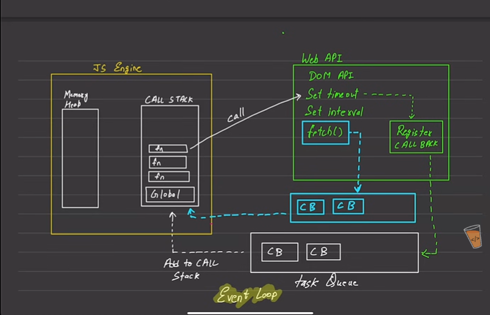
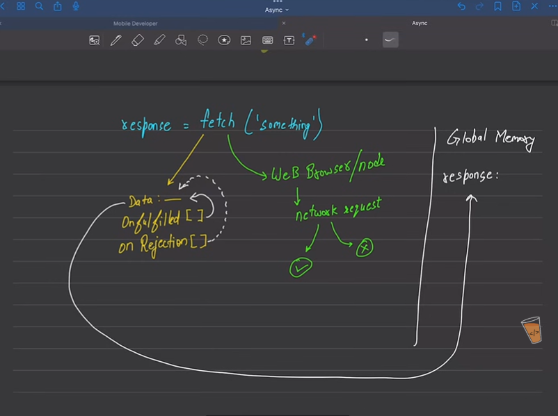
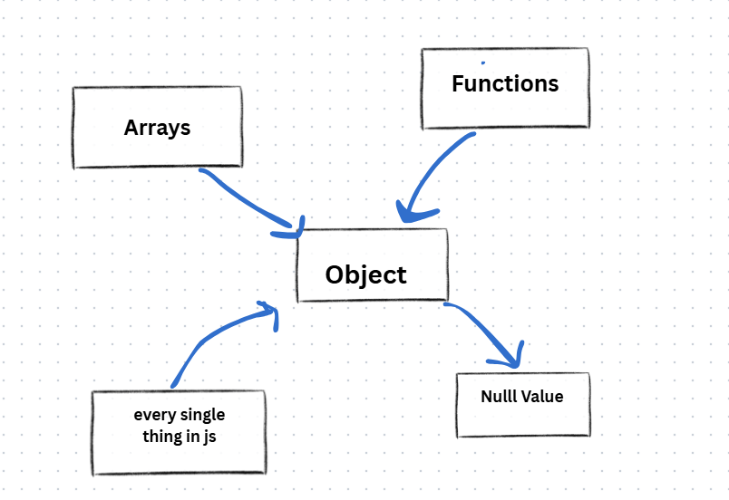

# javaScript-code
**JavaScript** is a **programming language** that’s mainly used to make web pages interactive and dynamic.  
It is one of the core technologies of the web along with HTML (structure) and CSS (styling)
**Client-side language:** Mostly runs in your web browser.

## Template Literal in js-->  
it is used to write veriable in string.

#### operator precedence->  
(bracket) > (**) > (*/%) > (- +)
### note:- 
->capital character is smaller when compare it by using comparision operator.  
->js run time environment uses **read evalute print loop**.
->js is case-sensitive.
->in js we don't have to declare the type of the variable.  

**bug that never fixed** -->in old days ->type tag of object was 'zero'(null)->that why the 'null' type is **object**
**NaN(not a number)**-->it represents invalid number in js  


## String in JavaScript--->
it is the collection of characters of any length.


### string mathods:-
1)**trim()-->**remove the extra space form the starting and ending point of the string
2)**toUpperCase()-->**ues to convert lower case into upper case 
3)**toLowerCase()-->** use to convert upper string into lower case.  
4)**indexOf() -->** return the first occurence index of the give string
5)**slice(starting index , ending index(exnclusive))-->** to get the substring of the given string    
6)**replace("oldstring" , "newstring")-->**use to replace search  the string inside the string and also replace the first occurence of that string with the newString


## Array of the javaScript:-
linear collection of datatype  
### syntax--> let arr = [] ; 
to find the size--> arrname.length  

->array is mutable in the javaScript 
push() , pop() , unshift() and shift()-->function of array to do operation  

## methods of array->  
1)includes()-->use to check that the given element is present in the array or not.  
2)indexOf()--->return the index of the given element in the array.
3)concat()--->use to merge two array  
4)reverse()-->use to reverse the array  
5)slice()--->return the subarray of the given array  
6)splice(start index , no.Of element delete , items to add)--->use to delete and add the element in the array by using only single function  
7)sort()--> only works for the array of strings because it convert the element into string if not and then sort it  
So, due to this array is sorted with respect to string  


### note:-  
even if the two array contian the same values still they are not equal as the comparison not solly done only on the values it also consider the memory storage
and that can't be same  if the array is different  

if the array is declare as a constant which not mean that its elements is fixed -->vales can be change but the memory storage they array point on to can't be changed.  

## types of array in javaScript  
### nested array(array inside array)  
```javascript
let arr = [[1 , 2 , 3 , 4] , [5 , 6, 7, 8] , [2 , 6, 7 , 8]];
let row = arr.length;
let col = arr[0].length;

a[0][0] = 1

```
### array of object(array containing element as a element) 
```javascript
        let arrr = [
            {
                name: "mayank",
                age: 20
            },
            {
                name: "ritik",
                age: 20
            },
            {
                name: "rohan",
                age: 30
            }
        ]

        for(let i = 0 ; i<arrr.length ; i++){
            console.log(arrr[i].name);
            console.log(arrr[i].age);
        }
        console.log(n3);

```


## object in Array  
it is use to store collection of key-value pair  
```javascript
const obj = {
     name: "mayank",
     age: 20

}
console.log(obj[name]);
console.log(obj.name);

object.key = newvalue;//to update and add the key value pair


```

### Note:-  
object does not follow specific order  
we can change the properties of the object  

when be using the variable that store the key then we not access the obj values by this way "obj.name"  
so, we have to use this way to "obj[name]"  

### Math object(inbuilt)  
Math.PI-->value of py  
Math.abe-->always gives +ive  
Math.pow(2 , 4) 
Math.floor(num)-->round off always give the value <=num  
Math.random()-->gvies the random values in the range **0<=val<1**
---

### note:-  
how to generate the random number between a give range  
** Math.floor(Math.random()*endPoint) +1 **-->to sure generated start from one
for case of range value other than One  
**Math.floor(Math.random()*end-start) + start**


## Memory allocation in javaScript-  
primitive data stores in **stack** and non-primitive data stores in **heap**  
and vales stored in heap will always give the reference to the variable but in case of **stack** it gives the copy of the data to the variable.  


### dates in javaScript:-  

```javascript
let myData = new Date();
mydate.toDateString();// give the  day , date with year
mydate.toLocalString();// give date- 00/00/0000 with time
//date is a object type

//month start form Zero in javscript

//we can also pass the args to get the specific time and year


```
--


## API fetching
### old ways of API fetching: XLMhttpRequest
<pre>
Value	    State	                     Description
0	        UNSENT	             Client has been created. open() not called yet.
1	        OPENED	             open() has been called.
2	    HEADERS_RECEIVED	     send() has been called, and headers and status are available.
3	    LOADING	Downloading      responseText holds partial data.
4	         DONE	             The operation is complete.
</pre>
it is the method ---> 
```javascript
    const requestUrl = 'https://api.github.com/users/hiteshchoudhary'//api url stored in the variable
    const xhr = new XMLHttpRequest();//creating a object
    xhr.open('GET', requestUrl)//takes method and string(request url)
    xhr.onreadystatechange = function(){//this is the method use to check the change on the states
//every time the state change automatically function calling occure
        console.log(xhr.readyState);
        if (xhr.readyState === 4) {
            const data = JSON.parse(this.responseText)// be most of the time get data in the form of string
//so, we have to convert it into json format(for conversion we use this)
            console.log(typeof data);
            console.log(data.followers);
        }
    }
    xhr.send();

```
## Note:- 
to use the api fetch data we can define it variable out side the state handler and intiallized in it when the data sucessufully fetched 
state handler like **onreadyStateChange** , **onload**

---

## promise:-
in simple words , as we know that js is single threaded language and due to brower features it behaves like a asynchrous manner
so, in most of the task can't be exicuted right after the reaquest because of that we use promise to assure the completion of the task.

### promise creation --->
```javascript
const promiseOne = new Promise(function(resolve, reject){
    //Do an async task
    // DB calls, cryptography, network
    setTimeout(function(){
        console.log('Async task is compelete');
        resolve()
    }, 1000)
})

promiseOne.then(function(){
    console.log("Promise consumed");
})

```
we don't have to store the promise inside the variable
```javascript
new Promise(function(resolve, reject){
    setTimeout(function(){
        console.log("Async task 2");
        resolve()
    }, 1000)

}).then(function(){
    console.log("Async 2 resolved");
})

```
promise with 'then' , 'catch'-->
```javascript
const promiseFour = new Promise(function(resolve, reject){
    setTimeout(function(){
        let error = true//to check the error if there any
        if (!error) {
            resolve({username: "hitesh", password: "123"})//value goes to "then"
        } else {
            reject('ERROR: Something went wrong')//handle by catch()
        }
    }, 1000)
})

 promiseFour
 .then((user) => {
    console.log(user);
    return user.username
}).then((username) => {//return data by next then
    console.log(username);
}).catch(function(error){
    console.log(error);
}).finally(() => console.log("The promise is either resolved or rejected"))//it gives the final verdict 

```
handling promise by using 'async' and 'await 
```javascript
const promiseFive = new Promise(function(resolve, reject){
    setTimeout(function(){
        let error = true
        if (!error) {
            resolve({username: "javascript", password: "123"})
        } else {
            reject('ERROR: JS went wrong')
        }
    }, 1000)
});//promise creation 

async function consumePromiseFive(){//async function for handling promise responses
    try {//as we also through reject and to handle it we have to use try catch inside the function
        const response = await promiseFive
        console.log(response);
    } catch (error) {
        console.log(error);
    }
}
consumePromiseFive();//async function calling
```

full working of async await and fetching the api in real time -->
```javascript
 async function getAllUsers(){
     try {
        const response = await fetch('https://jsonplaceholder.typicode.com/users')

        const data = await response.json()
      console.log(data);
    } catch (error) {
         console.log("E: ", error);
   }
 }

getAllUsers()
```

using fetch() with then and catch(modern way of API fetching)-->
```javascript
fetch('https://api.github.com/users/hiteshchoudhary')
.then((response) => {
    return response.json()
})
.then((data) => {
    console.log(data);
})
.catch((error) => console.log(error))

```
## note-imp-> 
in case of promise  , requesting something from a api and it gives the error code 404 then it will considered as a response.

promise does not reject on http errors
it will only rejects when a network and permission issue occure


---


---
### summary-->
in javaScript , there are two types of memory :-
1-heap Memory(where all got stored variable)
2-callStack(where all un-exicuted function are stored for exicution)

and this entired arrangmenet are called as js engine
and when in any function we can call 
DOM api
setTimeout and setInterval----->there calls goes to "register call back ------->stored in the task queue(waiting for exicution)

but in case of **fetch()** method ---> special queue was created which called a priority/micro task queue--->push the task in the call stack at top even before the "task queue"

which causes the api exicution first even it written after functions
that all is to it.

---



---
### summery-->
when we use fetch() method --> it requested in to parts:
1- web browser/node.js eviornment --->network request(responce or rejection)
2- data:___(where response data going to store)
-onfulfilled[]--->for response 
-onRejection[]--->for reject
after getting into either one of them and got initiallized in data_variable--->finally response shown to the user

---
## oops concept in javaScript:
in reality , javascript is the prototpe based language and its classes are primarily syntactic sugar over the existing prototype-based inheritance mechanisms.

**class:-** it is the blueprint or template for creating a object.  

**object:-** it is the instance of class and it will have the data and behavior defined by the class.  

in simple words , object is the collection of properties and methods/functions.  

## new keyword and this importance:-
**New Keyword**--> it is use to create a new instance of the object(copy of the object)  
 **working--->**  
copy object creation --> parameters are injected by the "this" keyword--> and then at the values return to the variable
```javascript
function user(username , logincount , age){
    this.username = username ;//this--> it is used here to differenciate the function variable and its arguments.
    this.logincount = logincount ;
    this.age = age;
}
const u1 = user("mayank" , 10 , 20);
const u2 = user("rohit" , 20 , 30);

console.log(u1);
conosle.log(u2);
//as we didn't used new keyword--> values was override by the second calling with there parameters
//to avoid that --> we use new keyword to make the saparate copy of the function
const u3 = new user("mayank" , 10 , 20);
const u4 =  new user("rohit" , 20 , 30);
console.log(u3);
conosle.log(u4);
```
---

## node->
prototype behaviour of javaScript--> even though the there is properties methods is exist but still js try to access the ojects parent and child until it gets a zero.  
that's why javaScript considered to be follow a prototype based inheritance   

every thing in js is object and all objects have all the properties that other object in the js have 
so , if we try then function can work as a object and as a normal function both at the same.


```javascript
function multipleBy5(num){

    return num*5
}

multipleBy5.power = 2

console.log(multipleBy5(5));
console.log(multipleBy5.power);
console.log(multipleBy5.prototype);
```

---

```javascript
function createUser(username, score){
    this.username = username
    this.score = score
}//its just a normal funtiom
//but we know --> it will also have the properties of an object
and we can add our own property into the function.prototype folder

createUser.prototype.increment = function(){//here is one custum method
    this.score++
}
createUser.prototype.printMe = function(){//her is second custum method
    console.log(`price is ${this.score}`);
}

const chai = new createUser("chai", 25)
const tea = createUser("tea", 250)
//we can not use our custom function in case of tea because we didn't initiallized the change for it.
//for this use "new" keyword to do that
chai.printMe()//now we can call it
// and because of the syntactic sugar of the js be don't have to do the object drilling to use the function

```
---

###Here's what happens behind the scenes when the new keyword is used:

A new object is created: The new keyword initiates the creation of a new JavaScript object.

A prototype is linked: The newly created object gets linked to the prototype property of the constructor function. This means that it has access to properties and methods defined on the constructor's prototype.

The constructor is called: The constructor function is called with the specified arguments and this is bound to the newly created object. If no explicit return value is specified from the constructor, JavaScript assumes this, the newly created object, to be the intended return value.

The new object is returned: After the constructor function has been called, if it doesn't return a non-primitive value (object, array, function, etc.), the newly created object is returned.


---
```javascript

//old time's inheritence
const User = {
    name: "chai",
    email: "chai@google.com"
}

const Teacher = {
    makeVideo: true
}

const TeachingSupport = {
    isAvailable: false
}

const TASupport = {
    makeAssignment: 'JS assignment',
    fullTime: true,
    __proto__: TeachingSupport
}

Teacher.__proto__ = User

// modern syntax
Object.setPrototypeOf(TeachingSupport, Teacher)
```

---
## call and this:-

```javascript
function SetUsername(username){
    //complex DB calls
    this.username = username
    console.log("called");
}

function createUser(username, email, password){
    SetUsername.call(this, username)
//if simple call the setusername function --> it exicuted and get remove from the call stack but we need the changes that it done
// so , we need the reference of that function
// but only reference can't  make changes on the parent function

// as every function have there own "this"--> so to get the changes we have to pass the parent "this" in outer function
// by doing so , outer function use the parent function this and changes will heppens in that function in which the outer got called
   
    this.email = email
    this.password = password
}

const chai = new createUser("chai", "chai@fb.com", "123")
console.log(chai);
```

---

### modern oops syntax of javascript
-(syntactic sugar)

```javascript
class cName{
    constructor(username , email , password){
        this.username = username;
        this.email = email;
        this.password = password;
    }
    encryptPassword(){
        return `${this.password}abc`;
    }
}

const user1 = new cName("mayank" , "mkg@gmail.com" , "1234");
console.log(chai.encryptPassword());

// behind the scene

function User(username, email, password){
    this.username = username;
    this.email = email;
    this.password = password
}

User.prototype.encryptPassword = function(){
    return `${this.password}abc`
}
User.prototype.changeUsername = function(){
    return `${this.username.toUpperCase()}`
}


const tea = new User("tea", "tea@gmail.com", "123")

console.log(tea.encryptPassword());
console.log(tea.changeUsername());

```

## inheritance:-
```javascript
class User {
    constructor(username){
        this.username = username
    }

    logMe(){
        console.log(`USERNAME is ${this.username}`);
    }
}

class Teacher extends User{
    constructor(username, email, password){
        super(username)
        this.email = email
        this.password = password
    }

    addCourse(){
        console.log(`A new course was added by ${this.username}`);
    }
}

const chai = new Teacher("chai", "chai@teacher.com", "123")

chai.logMe()
const masalaChai = new User("masalaChai")

masalaChai.logMe()

console.log(chai instanceof User);

```

## static keyword:-
it is used to stop the access of the methods and variables of class by its object and inheritend classes


### bind :-

```HTML
<!DOCTYPE html>
<html lang="en">
<head>
    <meta charset="UTF-8">
    <meta name="viewport" content="width=device-width, initial-scale=1.0">
    <title>React</title>
</head>
<body>
    <button>Button Clicked</button>
</body>
<script>
    class React {
        constructor(){
            this.library = "React"
            this.server = "https://localhost:300"

            //requirement
            document
                .querySelector('button')
                .addEventListener('click', this.handleClick.bind(this))

        }
        handleClick(){
            console.log("button clicked");
            console.log(this.server);
        }
    }

    const app = new React()
</script>
</html>

```


